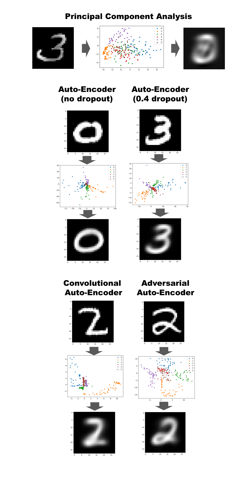

# Dimensionality Reduction with Autoencoders

Comparing different Autoencoders with a bottleneck of 2 dimensions. Visualization and comparaison with PCA.   

The PCA script is a notebook. The other ones are python scripts so the user can select what GPU to run on.  

The AutoEncoder used there are: A fully connected AutoEncoder with and without dropout. A Convolutional Autoencoder and an Adversarial Autoencoder (Gaussian Prior).  
The tests were done with between 50 and 100 epochs. 
The fully connected network seem to be alright at reconstructing the digits but the embedding space is not great compared to the Convolutional one.
The Adversarial Autoencoder (AAE) takes much longer to converge. It is mostly beacause the AAE has to fit a multimodal distribution from
the digits (with at least 10 modes one for each digits) to a gaussian distribution with a single mode.  

